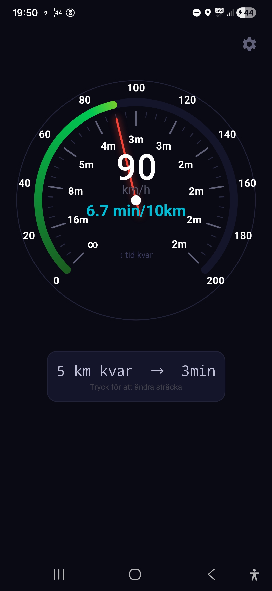

# Paceometer

<p align="center">
  
  &nbsp;&nbsp;
  
</p>

A GPS-based speedometer for Android with a clean, dark round dial. Shows speed in km/h, pace in min/10km, and estimated time to a target distance — all at a glance.

## Features

### Three ring view modes
Tap anywhere on the dial to cycle through three display modes:

| Mode | Inner ring | Outer ring |
|------|-----------|------------|
| **km/h** | Speed scale (0–200 km/h) | Pace (min/10km) |
| **Time remaining** | Time to target at each speed | km/h scale |
| **Pace + time** | Time to target at each speed | Pace (min/10km) |

### Center display
- Current speed as a large digital number
- Pace on two lines: **"x.y min / 10 km"** in cyan
- Shows **∞ min** when standing still

### ETA card
Displayed below the dial. Shows remaining kilometres and estimated arrival time at current speed. Tap the card to set a new target distance — the driven-distance counter resets automatically.

### Settings
- Toggle km/h scale, pace, and ETA card on/off individually
- **Speed-coloured arc** — replaces the blue gradient with a green → yellow → orange → red scale based on speed

### Other
- Smooth needle animation
- Screen stays on while the app is open
- Driven distance persists across restarts

## Requirements

- Android 8.0 or later (API level 26)
- GPS / location permission

## Installation

1. Download the latest APK from the [Releases](../../releases) page
2. On your Android device, go to **Settings → Apps → Special app access → Install unknown apps** and allow your browser or file manager
3. Open the downloaded APK and tap **Install**

## Build from source

```bash
git clone https://github.com/bengt-a/Paceometer.git
cd Paceometer
export ANDROID_HOME=/path/to/your/android-sdk
./gradlew assembleDebug
```

The APK is written to `app/build/outputs/apk/debug/app-debug.apk`.

Requires Android SDK with API 34 build tools and Java 17.

## License

Copyright © 2026 Bengt Alverborg. All rights reserved.
